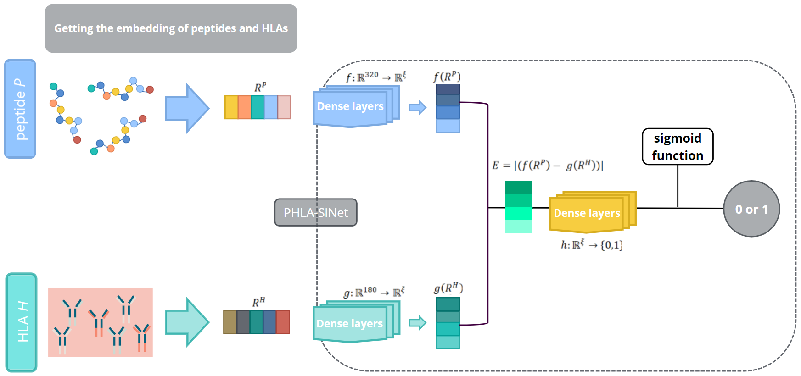

# PHLA-SiNet
**Peptide-HLA Interaction Prediction Using Siamese Neural Networks**

 

## Abstract

The Human Leukocyte Antigen (HLA) system is crucial in the immune response, presenting peptides to T cells to distinguish between self and non-self. This study introduces PHLA-SiNet pipeline, a novel computational approach to predict peptide-HLA (PHLA) interactions, using the diversity and specificity of HLA molecules. We propose an information content-based feature for HLAs, derived from their associated peptides, and utilize ESM embeddings to represent peptides. By employing a Siamese Neural Network (SNN), we predict PHLA interactions, addressing limitations of existing models that rely on HLA names or sequences. Our pipeline enhances prediction accuracy by including a new biological feature for HLA molecules based on binding and non-binding peptides. Additionally, we overcome constraints of models restricted to peptides length by employing a large language model for flexible peptide representation. This approach demonstrates improved performance in predicting PHLA interactions, offering a strong tool for advancing cancer immunotherapy and other HLA-related research.

## Features

- 🧬 **Novel HLA features**: Information content-based representation derived from binding/non-binding peptides
- 🧠 **Advanced peptide embeddings**: ESM-2 language model for sequence representation
- ⚡ **Siamese architecture**: Neural network optimized for interaction prediction
- 🔄 **Flexible handling**: Works with both known and novel HLA alleles
- 📊 **Multiple input formats**: Accepts single sequences or batch files

## Requirements
- Python 3.8+
- TensorFlow 2.6+
- PyTorch 1.12+ (for ESM embeddings)
- fair-esm 0.4.2+
 
### Quick Install
```bash
!git clone https://github.com/maryamnazarloo/PHLA_SiNet.git
%cd PHLA_SiNet
!pip install -r requirements.txt
```
# Usage
## Basic Prediction
```bash
!from hla_predictor import HLAPredictor

# Initialize predictor
predictor = HLAPredictor(
    model_path="models/siamese_net.h5"
)

# Predict single pair
probability = predictor.predict_single(
    peptide="ACDEFGHIK", 
    hla_allele="HLA-A02:01"
)

# Batch prediction from file
results = predictor.predict("input_samples.csv")
```
## Input File Format
Create a CSV file with these columns (example below):

| HLA        | peptide   | HLA_sequence                  |
|------------|-----------|-------------------------------|
| HLA-A02:01 | ACDEFGHIK | MVVMAPRTLFLL... (pseudo sequence) |
| HLA-B07:02 | YLLPAIVHI | MAVMAPRTLLL...               |

**Note: HLA_sequence is only required for novel HLA alleles not in the training data**

## Dataset
This project uses training and testing data (both External and Independent) from the [TransPHLA-AOMP](https://github.com/a96123155/TransPHLA-AOMP) dataset.  

[](https://github.com/a96123155/TransPHLA-AOMP)

## Contact
For any questions, please contact:
Maryam Nazarloo
maryamnazarloo966@gmail.com
